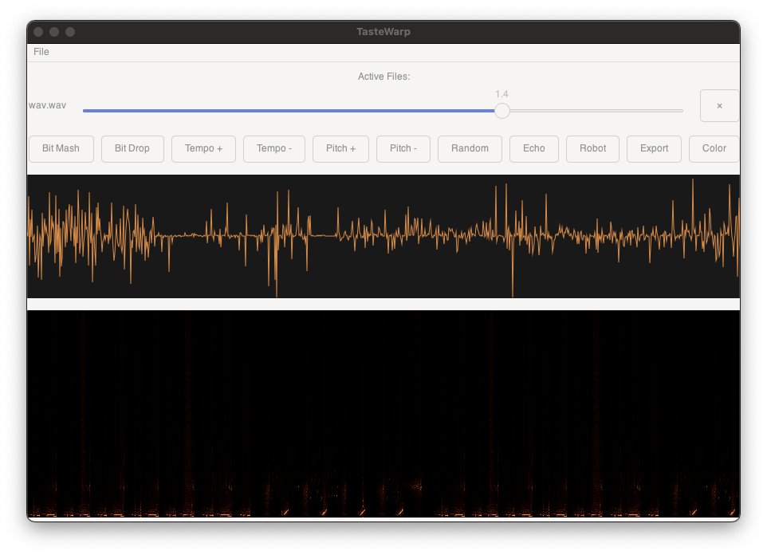

# TasteWarp

TasteWarp is an experimental audio manipulation tool that lets you "taste test" different audio effects and randomly combine sounds. It provides real-time visualization and interactive audio mangling capabilities.



## and all i did was use cursor for an hour starting here

gcc c app called bitglitcher:
input is a WAV file
UI/buttons and functions for bit mash, bit add/drop, tempo shift, pitch up/down, random effect, add echo/robot
option to export last 60 seconds of audio
wav file and all gltiches just stay looping until user closes app
visualization of wave form and spectogram of ongoing audio generationa and glittching

I'll help you create a BitGlitcher app using C with GTK for the UI and various audio processing features. Here's a structured approach:
First, let's create the basic project structure:
md
Let's start with the main header files to define our structures and functions:

## make and build from source

```bash
git clone https://github.com/un1crom/i-want-you-to-tastewarp.git
cd i-want-you-to-tastewarp
make
./tastewarp
```

## Download

### macOS

1. Download the latest release for macOS from the [Releases page](https://github.com/un1crom/i-want-you-to-tastewarp/releases)
2. Double-click the downloaded .dmg file
3. Drag TasteWarp to your Applications folder
4. Right-click TasteWarp in Applications and select "Open" (required first time only due to security)

### Linux
1. Download the latest release for Linux from the [Releases page](https://github.com/un1crom/i-want-you-to-tastewarp/releases)
2. Extract the .tar.gz file
3. Install dependencies:

I might be missing stuff here. use AI to figure it out. hahaha
   ```bash
   # Ubuntu/Debian
   sudo apt install libgtk-3-0 libpulse0 libfftw3-3

   # Fedora
   sudo dnf install gtk3 pulseaudio-libs fftw

   # Arch
   sudo pacman -S gtk3 libpulse fftw
   ```
4. Run the executable: `./tastewarp`

### Windows
Currently not supported

just use cloud computer or use WSL or something.